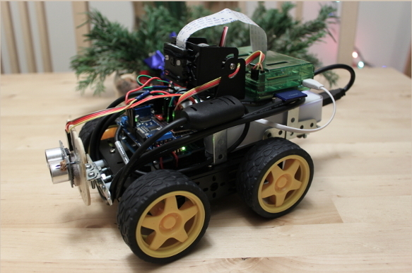
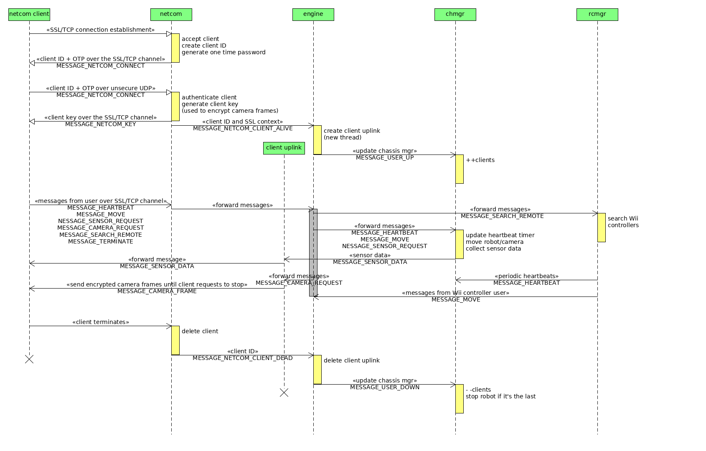

### Arduino and Raspberry Pi based home sentry robot

This is a fun project that aims to build a "camera on wheels", which can be controlled over the
Internet with a client application. The software is written in C++, it uses the Raspicam
library (with OpenCV) for capturing camera frames, and the OpenSSL library to establish a
secure connection. I also added support for Wii controllers just for fun.

The server is running on a Raspberry Pi, which is connected to an Arduino Uno through the Pi's
GPIO ports. One of the USB ports of the Pi has a Wifi dongle to connect it to the home router,
the other port can be used to plug-in a Bluetooth dongle for the Wii controller(s). The Arduino
receives commands from the Pi, and it is responsible for moving/turning the robot, rotate the
camera servo, and read the sensors (I added a temperature sensor and a distance sensor). The
camera stream is provided by a raspi camera. The whole system is powered by a beefy 10A battery
pack that I picked up from Adafruit.

The connection establishment and control messages are using a TCP socket, while the camera
frames are transmitted over UDP. The UDP "connection" is initiated by the client, this way it
works even if the client is behind a NAT router.

The TCP line is secured by SSL, and the camera frames are encrypted by XOR-ing a random
generated key (provided by the server) to the frame data. Unfortunately I was unable to
configure the OpenSSL library's DTLS properly, which is how I originally wanted to secure the
UDP channel. This XOR-encryption should be good enough to hide the images from the naked eye,
because the attacker won't be able to use known-plaintext attack.

* 1. prepare the Raspberry Pi with raspbian

  These are the steps I took with raspbian, adjust to your own system if you want to do things
  differently.

** 1.1 operating system

   Download and install latest raspian image, follow the official instructions:
   http://www.raspbian.org/

   During first time setup (or later in raspi-config) select high/turbo mode, enable camera,
   and split memory with gpu_mem set to 128, which is needed by the camera.

** 1.2 update the system and install necessary packages

   The following commands should take care of the base system:

     apt-get update
     apt-get upgrade
     apt-get install bluez bluez-utils libbluetooth-dev libopencv-dev libssl-dev
     rpi-update

   The application uses bluetooth, SSL, and the raspicam library for the Raspberry Pi camera,
   which you can download and install from here:
   http://www.uco.es/investiga/grupos/ava/node/40
   (you may want to set the prefix to /usr, for example, cmake -DCMAKE_INSTALL_PREFIX=/usr ..)

   It also uses the wiiuse library for the Wii controllers. Apparently this library keeps
   changing owners and location. I'm using version 0.12 which works fine for me, and I had
   trouble installing other versions. Here are a few links:
   https://github.com/rpavlik/wiiuse
   http://mission-cognition.houseoftechnology.org/projects/wiiusecppandpywii
   https://github.com/grandelli/WiiC

   I have included the v0.12 in the repo under the lib directory, just in case (note that a
   small patch needs to be applied to wiiuse to fix a compilation issue, it's also included).

** 1.3 setup wireless

   Edit /etc/network/interfaces and add these lines:

     auto wlan0
     allow-hotplug wlan0
     iface wlan0 inet dhcp
       wpa-ssid "SSID"
       wpa-psk PSK

   Note: replace PSK with the output of "wpa_passphrase SSID yourpassword" command

** 1.4 setup Raspberry Pi camera

   This will load the camera driver:

     modprobe bcm2835-v4l2

   Due to the position of the camera in my chassis, I flip the image:

     v4l2-ctl --set-ctrl horizontal_flip=1,vertical_flip=1

   You might want to add this line to /boot/config.txt to ensure wifi gets power:

     max_usb_current=1

   Note: if you want to disable the camera LED, then add this to /boot/config.txt:

     disable_camera_led=1

** 1.5 autostart

   Add something like this to your /etc/rc.local

     cd </path/to/sentry/> && bin/sentry -c cfg/default.cfg -s &

* 2. connect Raspberry Pi and Arduino

  For details please check out Oscar Liang's blog, he explains a few ways how to achieve this.
  http://blog.oscarliang.net/raspberry-pi-and-arduino-connected-serial-gpio/

  I decided to go with the serial connection with a logic level converter, as both USB ports on
  the Pi are used (i.e. for WiFi and Bluetooth). Here's how I did the wiring, based on Oscar's
  guides:

  Raspberry Pi   Logic Level Converter   Arduino
     Pin 1              LV / HV             5V
     Pin 6                GND               GND
     Pin 8             Channel 1            Rx
     Pin 10            Channel 2            Tx

  You also need to disable serial output, by removing the following from /boot/cmdline.txt

    console=serial0,115200

* 3. fire up sentry

  The steps in short: compile and install the Wii libraries, compile the sentry, create the SSL
  certificates, update the config file, then you are ready to go. Don't forget to compile and
  upload the Arduino code.

  a. generate certificate and keyfile

     Run the following command for the server certificates and keys:

       openssl req -x509 -nodes -days 365 -newkey rsa:2048 -keyout server_key.pem -out server_cert.pem

     Do the same for each client that will connect to the server, then sign them with the
     following command:

       openssl x509 -in ca1_cert.pem -text >> clients.crt

     Keep in the cfg directory the server_cert.pem, server_key.pem and clients.crt on the pi,
     and the client certificates (e.g. ca1_cert.pem, ca1_key.pem) on the client machine.

  b. build sentry

     Compile the server on the Raspberry Pi:

       make sentry

     Compile the client on the client machine:

       make netcom-client

     Build and upload the arduino code using the Arduino IDE, ino/ano, or other tools.
     Note: you may have to link with -lopencv_imgcodecs on the client machine side.

  c. configure the server

     A sample can be found in data/sentry.cfg, the default settings should work fine.

  f. start the server

     The following (optional) command line args are supported:
       -v                verbose debug level
       -vv               very verbose debug level
       -c <configfile>   use the given config file (default is data/sentry.cfg)
       -l <logfile>      redirect std::cout to the given file
       -s                log messages to syslog

  g. connect with the client

     You can start multiple clients with the same binary. Args:
       hostname   IP address of the server
       portnum    server port for the control messages (stream uses portnum++)
       cid        camera ID, pick a unique number per client

     The following keys are supported:
       WASD   moving and turning (once to start moving, again to stop)
       f      rotate camera up
       v      rotate camera down
       c      start/stop camera stream
       r      send a remote controller search command
       z      send a sensor data request message
       t      send a server terminate command
       q      exit client application

* 4. controlling the sentry

  The following keys are supported with the netcom-client:

    WASD   moving and turning (once for move, twice for stop)
    f      rotate camera up
    v      rotate camera down
    c      start/stop camera stream
    r      send a remote controller search command
    z      send a sensor data request message
    t      send a server terminate command
    q      exit client application

  You can also control the sentry with a Wii controller (hold it horizontally):
    2              move forward
    1              move backward
    left-arrow     turn left
    right-arrow    turn right

* 5. notes and caveats

  To test the camera speed/settings etc:

    (pi): raspivid -t 0 -hf -vf -w 640 -h 480 --nopreview -o - | nc -l 5000
    (pc): nc $RASP_IP 5000 | mplayer -nosound -framedrop -x 640 -y 480 -fps 60 -demuxer +h264es -cache 1024 -

  I used a combination of Raspberry Pi and Arduino because I had them around unused. Feel free
  to build your robot with different boards, e.g. newer Raspberry Pi models with integrated
  wifi, PCduino, beaglebone, etc.

  If you prefer Arch Linux over Raspbian, here are some notes to help you with that.

  a. download and install latest arch image
     https://archlinuxarm.org/platforms/armv6/raspberry-pi

  b. change /boot/config.txt to high mode

  c. select your preferred server in /etc/pacman.d/mirrorlist

  d. update the system and install necessary packages (as root)

       pacman -Suy
       pacman -S base-devel wicd bluez bluez-utils bluez-libs opencv git openssl

  e. setup your camera and wireless as required (e.g. wicd-curses), make sure to enter the
     wireless interface name in preferences (capital P), the configuration of your AP (right
     arrow over the AP item with your ESSID), and don't forget to check the box to
     automatically connect to the wireless network. Also, enable autoload for the wifi:

       systemctl enable wicd

  f. you may want to disable DHCP on the wired link to speed up the boot process, otherwise it
     will take some time for it to timeout, since the cable is not plugged in:

       systemctl disable dhcpcd@eth0

  The rest of the setup is same as described in the raspbian section, the only difference is
  disabling the console on the serial port:

    systemctl disable serial-getty@ttyAMA0.service

  Note: ls /etc/systemd/system/getty.target.wants/ for the actual service

* 6. TODO list

  - Android client
  - Qt client
  - use DTLS to secure the UDP packets
  - make Wii library dependency optional
  - use cmake
  - check the signal handler, does not work properly when linking with the opencv_highgui

/* Local Variables:  */
/* mode: org         */
/* End:              */
